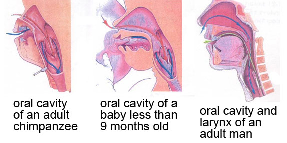
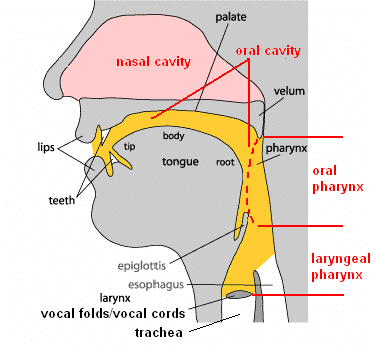

*As usual, read this blog, do the Fitch reading, and then take the quiz on Top Hat to test your understanding.*

This week we're reading Chapter 8 (pages 297-337) of Fitch (2010) ([available online via DiscoverEd](https://discovered.ed.ac.uk/permalink/44UOE_INST/7g3mt6/alma9922363073502466)). The theme for this week is the learning of speech and grammar. The lecture will focus on the evolution of the mechanisms underlying speech and vocal learning, and the comparative psychology of grammar learning (which might give us some insights into the evolution of the human capacities in that domain): the reading provides relevant background information on the physical apparatus behind speech (mainly the vocal tract).

## About the reading

The bulk of this chapter is on the position of the larynx in humans and other animals -- Fitch has done important work here, using comparative data to overturn some widely-accepted but incorrect assumptions about the uniqueness of the human descended larynx. 

As described in the reading, most animals, and very young humans, have a larynx that is positioned high in the throat, which allows them to engage the larynx directly with the velum, forming a nice tight seal which prevents food/liquid being inhaled. In many other animals, and young human infants, the larynx engages with the velum and nasal cavity, making it possible to breathe through the nose (red arrows) while swallowing (blue arrows). 

  \
*Image from http://thebrain.mcgill.ca/flash/capsules/outil_bleu21.html.)*

The resting position of the adult human larynx is lower in the throat, and too far down to allow the larynx to engage with the velum in this way. 

The larynx moves to its lower position early in development (around age 3 months), with a second descent to an even lower position occurring during puberty in males only (which turns out to be informative about possible evolutionary functions for the low position of the larynx in humans, see below). This low larynx position increases (at least hypothetically) the risk of choking -- every time you swallow, the stuff you are swallowing has to pass over the top of your windpipe and into the oesophagus, the epiglottis pulls down over the opening to the windpipe to cover the opening, as shown quite nicely in [this animation](https://www.youtube.com/watch?v=UNwXoW7z24E).

It has long been thought that the risks of the descended larynx -- the danger of choking on food or liquid -- must be outweighed by some advantage, perhaps related to language?

  \
*Annotated diagram of the adult human vocal tract - useful for terminology. From [https://www.researchgate.net/figure/Anatomical-structure-of-human-vocal-system-Adapted-from-How-language-works-Indiana_fig3_259333765](https://www.researchgate.net/figure/Anatomical-structure-of-human-vocal-system-Adapted-from-How-language-works-Indiana_fig3_259333765)*

One possibility is that the lower position of the larynx also drags the tongue root down into the pharynx, which gives us a two-tube vocal tract: we can manipulate the size of the oral cavity with the tongue tip, and independently manipulate the pharyngeal tube by pushing the tongue backwards and forwards -- this is really nicely illustrated in [the MRI images on this page, under section 2 "Vowel Articulation"](http://www.phon.ucl.ac.uk/courses/spsci/iss/week5.php). The idea is that this two-chamber vocal tract gives access to a wider range of formant frequencies, boosting the range of distinctive speech sounds we can produce.

However, as explained in section 8.4 of the Fitch reading, it turns out that the low position of the larynx/tongue root in humans isn't actually very unusual. Firstly, many other mammals (including e.g. dogs) can dynamically reconfigure their vocal tract during vocalisation -- they pull their larynx low in the throat while vocalising, giving them (temporarily) a two-tube vocal tract very similar in configuration to ours. Second, it turns out that many other species (e.g. koalas, big cats, deer) have a *permanent* low larynx position, giving them a two-tube vocal tract similar to humans -- you can see the low resting position of the larynx (big lump in the throat), and also the fact that these animals pull it even lower when vocalising, in [this video of a vocalising red deer](https://www.youtube.com/watch?v=xJxfTyJNp_o) (courtesy of Tecumseh Fitch).

There are two consequences of this. Firstly, since many mammals can reconfigure their vocal tract while vocalising, previous attempts to figure out the position of the larynx/tongue root in fossil hominids are rather pointless -- even if we were able to infer a high resting position, there would still be the possibility that the vocal tract was reconfigured during vocalisation. Second, since a (permanently or temporarily) descended larynx/tongue root is seen in species that don't have language or even complex vocalisations (e.g. deer, big cats -- they basically just roar, which I think we can all agree is pretty spectacular but not language), there must be some other pressure that explains the convergent evolution of the descended larynx in humans and these other species.

Fitch suggests that the most likely explanation for the descended larynx is **size exaggeration** -- the lower your larynx, the longer your vocal tract, and the bigger you sound. This can be 'faked' to a certain extent by pulling your larynx lower, but is intrinsically an honest signal -- you can't pull your larynx outside your body, so bigger individuals have longer vocal tracts and sound bigger. Size exaggeration might be useful in sexual displays, in male-male competition (think of the roaring red deer) or more generally in territory defence (both male and female big cats roar, and both have a permanently descended larynx that emphasises their size for anyone hearing it). In humans, the second descent of the larynx in puberty in males suggests a sexual signaling function; the descent of the larynx in both sexes at age 3 months is presumably driven by different pressures, applying to both sexes. The descended larynx may therefore give us a nice vocal tract for producing contrastive speech sounds, but needn't (initially) have been selected for this function. Instead, the descended larynx might be a **preadaptation** for speech: the reconfigured vocal tract was originally selected for due to fitness payoffs associated with size exaggeration, then subsequently re-tooled for the benefits it offered for complex speech.

The overall picture on the human vocal tract is therefore that, sadly (?), humans aren't as special as we thought in our physical apparatus for speech production. Fitch briefly reviews the evidence suggesting that we also aren't special in our auditory apparatus for speech perception --we have a standard mammal ear, and other mammals have been shown to exhibit e.g. categorical perception effects that were at one point assumed to be uniquely human. For instance, chinchillas trained in the lab to discriminate between /t/ and /d/ show the same sort of discrimination curve as adult humans. [The original paper showing this](http://www.ai.mit.edu/projects/dm/kuhl-chinchillas.pdf) is quite short, if a little stomach-churning in terms of the training method used.

The conclusion is therefore that any human-unique adaptations for speech must be in the brain, not in the peripheral apparatus.

## References

Fitch, W. T. (2010). *The Evolution of Language*. Cambridge: Cambridge University Press.

## Re-use

All aspects of this work are licensed under a [Creative Commons Attribution 4.0 International License](http://creativecommons.org/licenses/by/4.0/).
